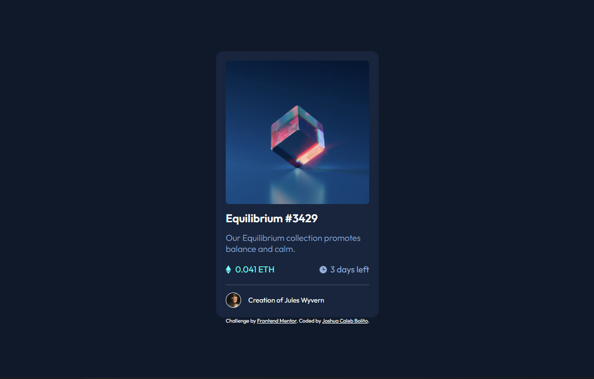
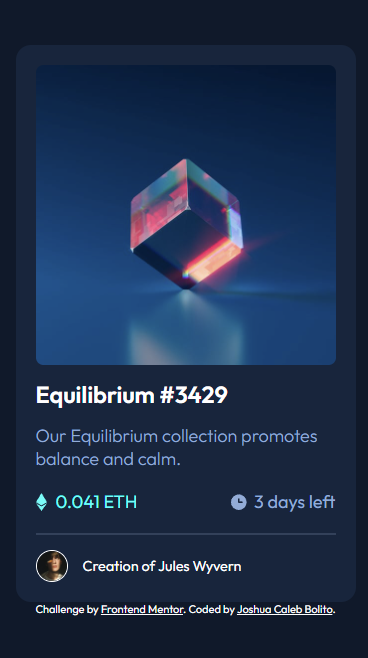
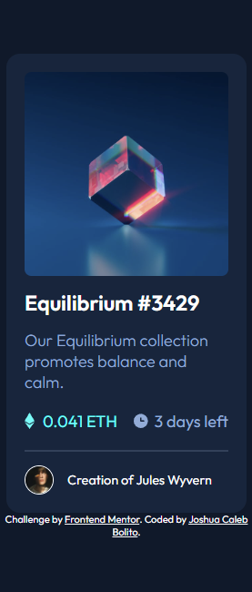

# Frontend Mentor - NFT preview card component solution

This is a solution to the [NFT preview card component challenge on Frontend Mentor](https://www.frontendmentor.io/challenges/nft-preview-card-component-SbdUL_w0U). Frontend Mentor challenges help you improve your coding skills by building realistic projects. 

## Table of contents

- [Overview](#overview)
  - [The challenge](#the-challenge)
  - [Screenshot](#screenshot)
  - [Links](#links)
- [My process](#my-process)
  - [Built with](#built-with)
  - [What I learned](#what-i-learned)
  - [Continued development](#continued-development)
- [Author](#author)

## Overview
This mini project involves the creation of an NFT Preview Card Component using plain HTML and CSS.

### The challenge

Users should be able to:

- View the optimal layout depending on their device's screen size
- See hover states for interactive elements

### Screenshot





### Links

- Solution URL: 
	- [HTML](https://github.com/JCBolito/nft-preview-card-component-main/blob/main/index.html)
	- [CSS](https://github.com/JCBolito/nft-preview-card-component-main/blob/main/style.css)
- Live Site URL: [GitHub Pages](https://jcbolito.github.io/nft-preview-card-component-main/)

## My process
Breaking down the project into smaller chunks, the following process were taken to guarantee the project's completion:

1. Structure the HTML.
1. Using Flexboxes, use CSS to design the webpage.
1. Adjust the CSS to make the webpage responsive and usable for various mobile device sizes, the smallest of which it can accomodate is the Samsung Galaxy Fold.

### Built with

- Semantic HTML5 markup
- CSS custom properties
- Flexbox

### What I learned

Upon completing this project, I was able to practice my skills in using Flexboxes and Responsive Web Design. Since this is a flexible component that does not need to have different desktop and mobile device interface, I simply maximized the capability of width, min-width, and max-width to make the component responsive.

The following block of code were used to make the component responsive:
```css
.mainImage,
main {
	min-width: 220px;
	width: 80vw;
	max-width: 300px;
}
```
The block of code above styles the adjusts the main component along with the main image in order for it to accomodate various device sizes.

Other than responsive web design, I also made this mini project to practice my CSS Selector skills which I admittedly struggled during the creation.

### Continued development

Although I am satisfied with my final output on this project, I feel like I could've my stylesheet a lot more cleaner. I feel like experimenting with various CSS Selectors made the stylesheet more cluttered and complicated than it had to be, but I do believe its cluttered nature is justifiable as I mainly did this mini project in order to practice my CSS Selector skills. With that, I will surely try to redo this project using my typical styling method to see whether the stylesheet would be neater and more readable.


## Author

- Website - [Joshua Caleb Bolito](https://github.com/JCBolito)
- Frontend Mentor - [@JCBolito](https://www.frontendmentor.io/profile/JCBolito)